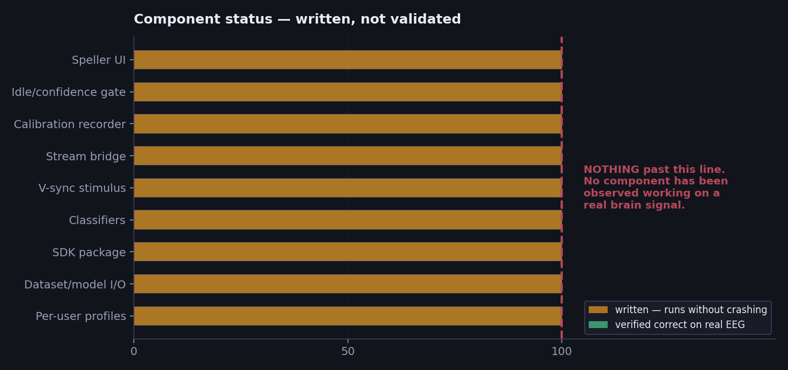
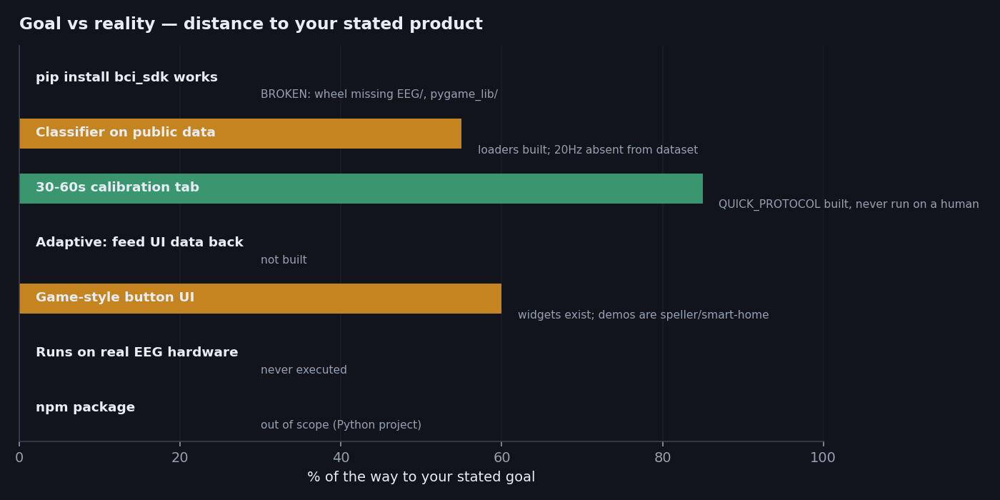
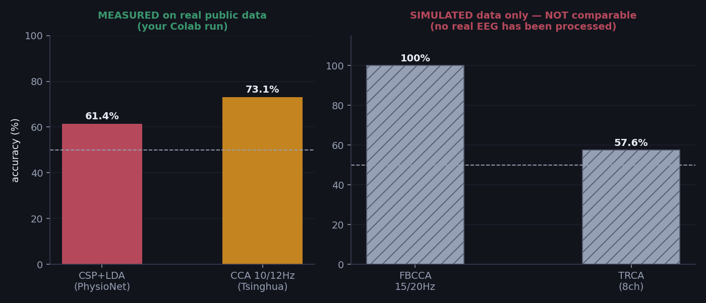
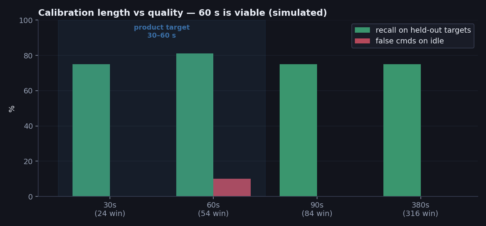
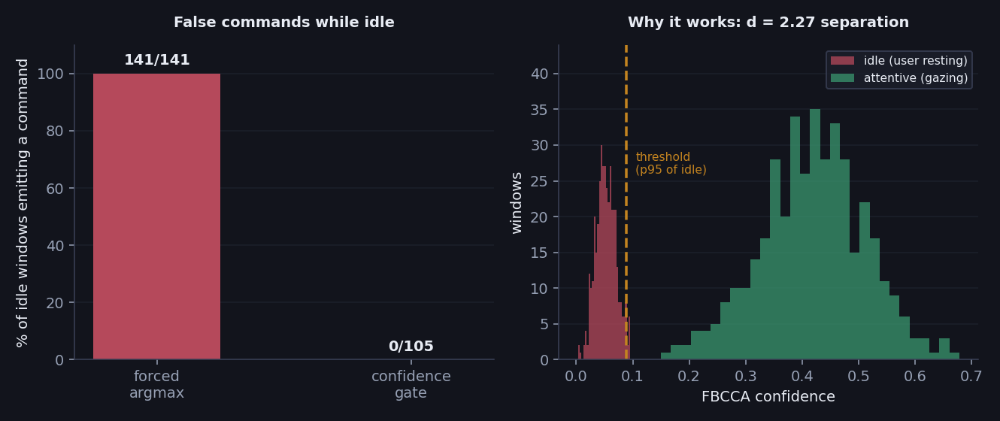
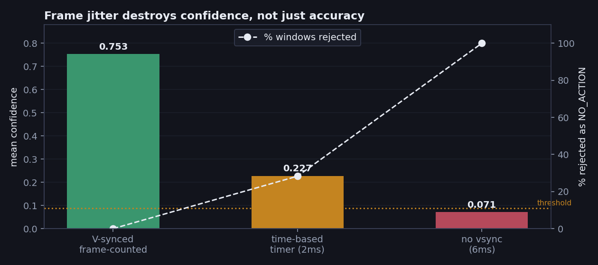
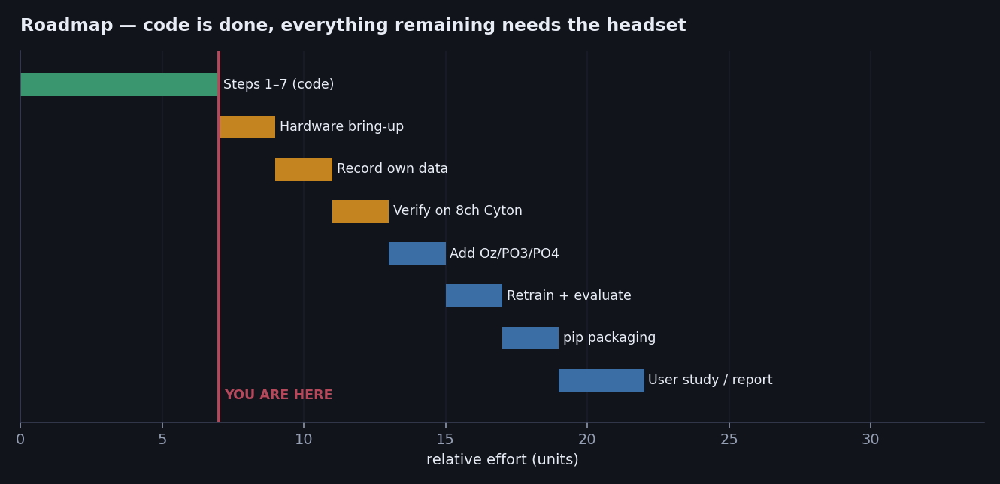

# Progress Report — EEG-Controlled Button Selection Library

**Project:** a pip-installable library for brain-controlled UI button selection
**Date:** 14 September 2026 · `bci_sdk` 0.9.0
**Status:** code written · **nothing verified** · **no real EEG has ever been processed**

---

## 0. Where we are right now

### One-line answer
**Everything is written; nothing has been run on a brain.** The project is at the point where
software work stops paying off and one hardware session becomes worth more than another week
of code.

### Physical state of the repository — verified on disk today

| Question | Answer | Evidence |
|---|---|---|
| Does the code exist? | ✅ yes, ~5,300 lines | ⚪ CODE |
| Is it in git? | ✅ yes, pushed to `features/big` | your `git` log |
| Does `pip install` work? | ❌ **no** | wheel built, `import bci_sdk` → `ModuleNotFoundError` |
| Has any EEG been recorded from a person? | ❌ **no** | the 2 `.npz` files on disk are `SimulateBackend` output |
| Has any model been trained? | ❌ **no** | `find . -name "*.joblib"` → empty |
| Has the Cyton ever been connected? | ❌ **no** | `BrainFlowBackend` written from docs, never executed |
| Is anything on Google Drive? | ✅ files placed | ⚪ your report; nothing executed there yet |

The two calibration files that exist —
`dataset/calib_S01_*.npz` (316 windows) and `profiles/anson/calib_anson_*.npz` (18 windows) —
were both generated by the synthetic backend. **Neither contains a real brain signal.** They
exist to prove the recording pipeline runs end to end, nothing more.

### Your stage vs where the code is

You described yourself as *"still at the CSP + LDA baseline."* That remains accurate as a
statement about **results**, and it is important not to confuse the two tracks:

| Track | Status |
|---|---|
| **Results / evidence** | still at your CSP+LDA (61.40%) and CCA (73.10%) baselines. Nothing has superseded them with real data. |
| **Code / architecture** | has moved well past that — FBCCA, TRCA, FBCSP, Riemannian, calibration, streaming, SDK all written |

The gap between those two rows is the entire remaining risk in the project. The code *claims*
to fix the problems in your baseline; none of those claims has been tested against a real
signal.

### What would change that

Steps 1–7 of the guide in §8. Realistically:

| | |
|---|---|
| Fix the package so it installs | ~1 hour, no hardware |
| Verify your monitor renders the flicker | 15 min, no hardware |
| Hardware bring-up + signal check | half a day, expect problems |
| First real calibration + analysis | ~1 hour |
| **Total to a defensible result** | **roughly one focused day** |

After that day you will know whether the approach works on your head — which is the one thing
this report cannot currently tell you.

### Estimated time to a publishable, usable library

Built bottom-up from the nine steps in §8, in **working days** (not calendar days).

| Milestone | Best case | Worst case |
|---|---|---|
| **v0.1 — works for you, `pip install`-able** | **2.5 d** | **7.6 d** |
| v0.1 *if* the electrode upgrade proves necessary | 4.5 d | 15 d |
| **v1.0 — validated on 3–5 users, defensible as a library** | **5 d** | **20 d** |

Per-step breakdown for v0.1:

| Step | Days | Confidence |
|---|---|---|
| 1 · Fix packaging | 0.15 – 0.25 | high — mechanical change |
| 2 · Monitor flicker check | 0.05 – 0.1 | high — no hardware needed |
| 3 · Hardware bring-up | **0.5 – 2.0** | **low — never attempted** |
| 4 · Signal quality / electrodes | **0.25 – 1.5** | **low — depends on contact** |
| 5 · First calibration | 0.1 – 0.25 | high, if 3–4 went well |
| 6 · Analyse (go/no-go gate) | 0.25 – 0.5 | high |
| 7 · Live interface tuning | 0.25 – 1.0 | medium — iterative |
| 8 · Game demo | 0.5 – 1.0 | high — pure software |
| 9 · Cleanup + real packaging | 0.5 – 1.0 | high |

In calendar terms, depending on how much time you can give it:

| Pace | v0.1 | v1.0 |
|---|---|---|
| Full-time (5 d/wk) | 0.5 – 1.5 weeks | 1 – 4 weeks |
| 3 days/week | 1 – 2.5 weeks | 1.7 – 6.7 weeks |
| 2 days/week | 1.3 – 3.8 weeks | 2.5 – 10 weeks |

**What the spread actually represents.** Steps 3 and 4 carry almost all the uncertainty
because neither has ever been attempted — the Cyton has never been connected, and electrode
contact quality is unknown. Everything else is either pure software (predictable) or short.

**The single largest risk to this estimate** is step 6 returning Cohen's d < 0.8, meaning
attention and rest are not separable on your hardware. That triggers the electrode upgrade
path and roughly doubles the timeline — and the procurement time for Oz/PO3/PO4 electrodes
(1–5 days) is outside your control, so order them early if you suspect you will need them.

**Caveat on these numbers.** They assume the architecture is sound and only integration work
remains. If step 6 reveals something fundamental — no usable SSVEP response at all — the
estimate does not apply, because the fix would be a design change rather than a task. That
outcome is unlikely (SSVEP is a well-established paradigm) but it is not impossible, and no
schedule built before a first hardware session can rule it out.

---

## How to read this report

### On the automated tests

This project has 311 automated assertions. **They are not evidence that the system works.**

They verify that functions return the shapes and types they promise, that a ring buffer
reconstructs a signal it was handed, that a callback fires when invoked. In other words: the
code executes without crashing and its internal contracts hold. That is a prerequisite for
correctness, not a demonstration of it.

They say **nothing** about:
- whether an electrode on your scalp produces a signal the classifier can use
- whether 15 Hz and 20 Hz are distinguishable on your hardware
- whether the confidence threshold separates your attention from your resting state
- whether the flicker is clean enough on your monitor to evoke a response at all

**Only you can establish those, by running the system and observing it.** This report treats
every performance figure as provisional until you do.

### Data provenance tags

| Tag | Meaning |
|---|---|
| 🟢 **REAL** | measured on real public EEG — your own Colab run |
| 🔵 **SIM** | produced by `SimulateBackend` — synthetic signals, proves nothing about hardware |
| ⚪ **CODE** | a property of the source (line counts, file lists, package contents) |
| ❌ **NONE** | no data exists |

**Two numbers in this report are 🟢 REAL: 61.40% and 73.10%.** Both are your pre-existing
baselines. Every other performance figure is 🔵 SIM.

---

## 1. Executive summary

| Finding | Severity |
|---|---|
| 🔴 **`pip install` is broken** — the wheel builds, but `import bci_sdk` fails | blocks your primary goal |
| 🔴 **No real EEG has ever been processed** | blocks all validation |
| 🟠 20 Hz is absent from the public dataset | limits "train on public data" |
| 🟠 Adaptive learning (feed UI data back) is not built | a stated goal |
| 🟠 No game-style demo exists | a stated goal |

Verified by building and installing the package:

```
$ python -m build --wheel
Successfully built bci_sdk-0.9.0-py3-none-any.whl
  top-level packages in wheel: ['ML', 'bci_sdk']
  EEG included?        False
  pygame_lib included? False

$ pip install bci_sdk-0.9.0-py3-none-any.whl && python -c "import bci_sdk"
ModuleNotFoundError: No module named 'stream_bridge'
```

`pyproject.toml` declares `packages = ["bci_sdk", "ML"]`, but `bci_sdk/__init__.py` imports
from `EEG/` and `pygame_lib/`. In your working directory a `sys.path` hack masks this; from
an installed wheel it fails on the first import.



---

## 2. Distance to your stated goal



| Your requirement | State | Gap |
|---|---|---|
| "people pip or npm install" | 🔴 **broken** | wheel omits 2 of 4 packages; never published. npm = separate project (Python codebase) |
| "classifier trained on public data" | 🟠 partial | loaders + `save()`/`load()` written ⚪; **20 Hz absent from Benchmark** |
| "30s–60s calibration tab" | 🟠 written | `QUICK_PROTOCOL` = 60 s ⚪; ❌ never run on a person |
| "feed interface data back to classifier" | 🔴 **not built** | see §6 |
| "real interface, game UI buttons" | 🟠 partial | widgets written ⚪; demos are a speller + smart-home panel |
| runs on your Cyton | 🔴 **never** | `BrainFlowBackend` written from documentation, never executed |

---

## 3. Your baseline — the only real measurements

🟢 **REAL** — from your Colab output:

| Model | Dataset | Result |
|---|---|---|
| CSP + LDA | PhysioNet EEGMMIDB, 4,927 trials, 8 ch | **61.40%** (±1.01) 5-fold CV |
| CCA @ 10/12 Hz | Tsinghua Benchmark, 420 trials, 64 ch | **73.10%** — 295 vs 125 predictions |



The panels are deliberately separate. Left is 🟢 REAL. Right is 🔵 SIM and says nothing about
your hardware.

### Diagnosis (reasoning from the literature, not measurement)

**73.10% with a 295/125 split on balanced data** is a class-bias signature. 10 Hz falls inside
the occipital alpha band (8–13 Hz), which the brain emits spontaneously when the eyes relax.
The classifier is asked to separate an *evoked* 10 Hz response from a *spontaneous* one at the
same electrodes. The code now defaults to 15/20 Hz for this reason — **an untested hypothesis
about your data, which step 6 below will confirm or refute.**

**61.40% ≈ chance** for 2-class MI is consistent with cross-subject transfer failure:
individual mu/beta peaks vary by several Hz.

---

## 4. What exists — ⚪ CODE

| Component | Files | Lines |
|---|---|---|
| Speller UI + text buffer | `example/bci_speller.py`, `ML/text_buffer.py` | 608 |
| Confidence gate / idle state | `ML/bci_engine.py`, `ML/hybrid_classifier.py` | 437 |
| Calibration recorder | `EEG/calibration_record.py`, `ML/calibration.py` | 713 |
| Acquisition bridge | `EEG/stream_bridge.py` | 545 |
| V-sync stimulus | `pygame_lib/stimulus.py`, `TileButton.py` | 439 |
| Classifiers | `ML/trca.py`, `ML/mi_advanced.py`, `ML/evaluate.py` | 889 |
| SDK package | `bci_sdk/` (5 files) | 901 |
| Dataset loaders + model I/O | `ML/datasets.py` | 303 |
| Per-user profiles + app | `bci_sdk/profiles.py`, `example/bci_app.py` | 494 |
| | | **~5,300** |

---

## 5. Simulated findings — hypotheses to test, not results

### Calibration length


🔵 SIM. The structural point survives: 60 s yields ~54 windows, enough to estimate a
threshold at all. The apparent 81.2% peak is noise — **do not quote it**.

### The idle problem


🔵 SIM. The *reasoning* holds independently of the numbers: `argmax` always returns a class,
so a classifier without a `NO_ACTION` output emits a command every time the user blinks or
thinks. Public benchmarks cannot expose this — they contain no "user isn't trying" trials.

### Stimulus timing


🔵 SIM, and measured on the dummy SDL driver **which does not vsync at all**. Demonstrates a
mechanism, not your monitor's behaviour.

---

## 6. Why adaptive learning is not built

Your goal asks to "feed the data from the actual interface to the classifier to train."

Without ground-truth labels, a mis-detection becomes training data and the model reinforces
its own errors. With a confidence gate in the loop, it can drift into never firing at all.

A safe version uses only *user-confirmed* selections (ones the user did not immediately undo)
as pseudo-labels, with a capped adaptation rate and the calibrated baseline retained as
fallback. Tuning that needs real sessions — it belongs after step 8 below, not before.

---

## 7. Redundant and misaligned files

Audited by grepping imports across the repo.

### 🔴 Not aligned with the goal — archive or delete
| File | Issue |
|---|---|
| `example/rockpaperscissors.py` | mouse-driven pygame test, no EEG |
| `example/realistic_ui.py` | same; imports no BCI code |
| `ML/ml_baseline_MotorImagery.py` | superseded; trains on `np.random` |
| `ML/ml_baseline_SsvepArtifacts.py` | superseded; simulated data |
| `EEG/test.py` | scratch file |
| `EEG/read_public_data.py` | superseded by `ML/datasets.py`; **0 references** |

### 🟠 Redundant
| Pair | Recommendation |
|---|---|
| `ML/sim_stream.py` vs `stream_bridge.SyntheticBackend` | superseded; 2 old tests still import it |
| `EEG/data_record.py` vs `EEG/calibration_record.py` | old character-flashing recorder; **0 references** |

### 🟡 Structural
`pygame_lib/` has no `__init__.py` — it is not a real package. This is part of why the wheel
is broken.

---

# 8. Execution guide — step by step

Nine steps. Each states **why it exists**, **what to do**, **what you should see**, **how to
tell it failed**, and **what it unblocks**. Do them in order; each depends on the last.

Record your observations as you go — those are the real results this report currently lacks.

---

## Step 1 · Fix the package so it installs
**Effort:** ~1 hour · **Blocks:** your primary goal

### Why
Your goal is "a library people pip install." Today the wheel omits `EEG/` and `pygame_lib/`,
so `import bci_sdk` fails immediately after install. It only works in your working directory
because `bci_sdk/__init__.py` manipulates `sys.path` — a workaround that cannot survive
packaging. Until this is fixed you have a folder of scripts, not a library.

### Do
1. Add empty `EEG/__init__.py` and `pygame_lib/__init__.py`.
2. In `pyproject.toml`:
   ```toml
   [tool.setuptools]
   packages = ["bci_sdk", "ML", "EEG", "pygame_lib"]
   ```
3. In `bci_sdk/__init__.py`, delete the `sys.path.insert` block and convert to real imports:
   ```python
   from EEG.stream_bridge import StreamBridge, SyntheticBackend, ...
   from pygame_lib.stimulus import StimulusEngine, open_display, ...
   from pygame_lib.TileButton import TileButton
   ```
4. Apply the same fix in `bci_sdk/session.py` and `bci_sdk/widgets.py`.

### Verify
```bash
python -m build --wheel
python -m venv /tmp/clean && /tmp/clean/bin/pip install dist/bci_sdk-0.9.0-*.whl
/tmp/clean/bin/python -c "import bci_sdk; print(bci_sdk.__version__)"
```

### Success
Prints `0.9.0` from a venv that has never seen your source directory.

### Failure
Any `ModuleNotFoundError` means a package is still missing from `packages` or an import is
still relative to the working directory.

### Unblocks
Everything about distribution. Also makes every later step reproducible for a teammate.

---

## Step 2 · Confirm your monitor can render the stimulus
**Effort:** 15 min · **Blocks:** all SSVEP work · **No headset needed**

### Why
SSVEP depends entirely on the screen flickering at a precise frequency. If your monitor is
not 60 Hz, 15/20 Hz may not be exactly renderable, and the classifier will be looking for a
frequency the screen never produced. This is the cheapest possible failure to rule out, and
it needs no hardware.

A concrete example of the risk: the original "flash every N frames" formula rendered 20 Hz as
15 Hz on a 60 Hz display — both tiles identical, classifier unable to separate them, no error
raised.

### Do
```bash
python example/bci_speller.py --flicker
```
Let it run ~30 s, then press ESC and read the printed report.

### Success
```
15.0 Hz -> 4 frames (2 on/2 off) = 15.00 Hz [exact]
20.0 Hz -> 3 frames (2 on/1 off) = 20.00 Hz [exact]
measured fps : ~60 (nominal 60.0)
dropped frames : 0 (0.00%)
```

### Failure
- Any target marked `ERROR` instead of `exact` → your refresh rate cannot render it. Run
  `bci_sdk.suggest_frequencies(your_hz)` and pick from that list.
- `dropped frames` above ~1% → V-sync is not active, or something else is using the GPU.
- A collision warning → two targets share a frame period; they are physically identical.

### Record
Your refresh rate, the realised frequencies, measured fps, drop rate.

### Unblocks
Everything. A bad stimulus makes every later measurement meaningless.

---

## Step 3 · Hardware bring-up
**Effort:** 1–3 hours, expect problems · **First contact with the Cyton**

### Why
`BrainFlowBackend` was written from BrainFlow's documentation and **has never executed**.
Board IDs, serial ports, and channel ordering are exactly the things documentation gets
subtly wrong. Discovering this during a calibration session wastes the session; discovering
it now costs nothing.

### Do
Test acquisition alone, before involving any classifier:
```bash
python EEG/data_receive.py          # your existing known-good plotting script
```
Then the new path:
```python
from EEG.stream_bridge import StreamBridge, BrainFlowBackend
b = BrainFlowBackend(board_id=0, serial_port="COM4")
br = StreamBridge(backend=b); br.start()
import time; time.sleep(10)
br.print_report()
br.stop()
```

### Success
```
effective fs : ~250 Hz (nominal 250, error < 1%)
windows made : ~7 (1.00/s steady-state)
dropped      : 0
backend errors : 0
```

### Failure
| Symptom | Likely cause |
|---|---|
| `BoardShim` exception on `prepare_session` | wrong `serial_port` or `board_id` |
| `effective fs` far from 250 | wrong board type; check `get_sampling_rate` |
| `backend errors` climbing | dongle disconnecting, or `read_available` mis-sized |
| All-zero or flat-line data | electrodes not connected / board not streaming |

### Record
Working `board_id` and `serial_port`, effective fs, error rate. **Fix the code and commit it**
— this is the first genuinely new information the project has had.

### Unblocks
Steps 4–9. Nothing downstream can happen until samples flow.

---

## Step 4 · Signal quality check before trusting anything
**Effort:** 30 min · **Do not skip**

### Why
A BCI can fail for a purely physical reason — dry electrodes, poor contact, mains
interference — and every software metric will look like an algorithm problem. Establish that
the signal is real *before* interpreting any classifier output.

### Do
With electrodes on and the subject seated, capture 30 s and inspect:
```python
import numpy as np
from EEG.stream_bridge import StreamBridge, BrainFlowBackend
br = StreamBridge(backend=BrainFlowBackend(serial_port="COM4")); br.start()
import time; time.sleep(15)
w = br.poll(); br.stop()
for ch in range(8):
    print(ch, "uV rms=%.1f" % np.std(w[ch]))
sp = np.abs(np.fft.rfft(w[6])); fr = np.fft.rfftfreq(750, 1/250)
for f in (10, 15, 20, 50):
    print(f"{f} Hz power:", sp[np.argmin(abs(fr-f))])
```

### Success
- Per-channel RMS roughly 5–50 µV. Occipital channels (O1/O2) should show a clear ~10 Hz
  alpha peak **with eyes closed** that shrinks when they open. This is the single best proof
  your rig is recording brain activity rather than noise.
- Mains peak (50 Hz in HK) present but not dominating.

### Failure
| Symptom | Meaning |
|---|---|
| RMS < 1 µV | channel not connected |
| RMS > 200 µV | poor contact, movement, or floating reference |
| No alpha change on eyes-closed/open | electrodes not on the occipital scalp, or bad contact |
| Huge 50 Hz | mains interference — move away from chargers, check ground |

### Record
Per-channel RMS, whether the eyes-closed alpha response appears. **If it does not, stop and
fix the hardware.** No amount of software will compensate.

### Unblocks
Confidence that later results reflect the algorithm, not the setup.

---

## Step 5 · First calibration recording
**Effort:** 15 min · **Produces your first real dataset**

### Why
Everything about the confidence threshold is currently guessed from simulation. This produces
the first genuine per-user data — and the idle blocks are the part public datasets can never
provide.

⚠️ **Photosensitive epilepsy:** this flickers at 15/20 Hz. Screen the participant, warn them,
and let them stop at any time.

### Do
Rehearse without hardware first so you know the flow:
```bash
python example/bci_app.py --user anson --quick
```
Then the real 60-second recording:
```bash
python example/bci_app.py --user anson --source hardware --serial-port COM4
```
Choose the 60 s `quick` protocol. Sit ~60 cm from the screen, consistent lighting. **Do the
idle blocks honestly** — actually rest and let attention wander. Idle data that is secretly
attentive sets the threshold too high and makes the speller unresponsive.

### Success
`profiles/anson/` contains a `calib_*.npz` and a `profile.json` with a threshold.

### Failure
- "could not fit a threshold (no clean idle data)" → every idle window was rejected as an
  artifact; `artifact_threshold` is too low for your amplitude range.
- Recording aborts → check the stream report from step 3.

### Record
The file path, the fitted threshold, and how the session felt (fatigue, flicker discomfort).

### Unblocks
Steps 6–9. This is the dataset the rest of the project has been waiting for.

---

## Step 6 · Analyse it — the first real evaluation
**Effort:** 30 min · **This is your evaluation chapter**

### Why
This answers the question the whole project rests on: **on your hardware, is an attentive
gaze distinguishable from resting?** Every simulated figure in §5 gets replaced here with a
real one.

### Do
```bash
python ML/calibration.py --recording "profiles/anson/calib_*.npz" --sweep
```

### Success
```
CONFIDENCE SEPARATION
  attentive  mean=...   sd=...
  idle       mean=...   sd=...
  separation (Cohen's d) = ...        <- the number that matters
  artifact windows rejected: n/m      <- should catch your deliberate blinks
GUI USABILITY METRICS
   pct  thresh  FP/min idle  precision  recall  ITR b/min
```
**Cohen's d > 1.5** means attention and rest are separable and the approach works on your
head. **d < 0.8** means it is not working yet — see below.

### Failure and what each cause implies
| Observation | Interpretation | Action |
|---|---|---|
| d < 0.8 | no usable SSVEP response | check step 2 (flicker) and step 4 (electrodes); try sitting closer, dimmer room |
| High attentive variance | inconsistent gaze | longer blocks, clearer fixation instruction |
| Blinks not caught | `artifact_threshold` wrong for your amplitudes | tune it to your step-4 RMS |
| Strong 10 Hz bias returns | alpha still interfering | confirms the §3 hypothesis; consider 15/30 Hz |

### Record
**The full output.** This table is the first real evidence the project has produced, and it
belongs verbatim in your report. Compare Cohen's d against the 🔵 SIM value of 2.27 and
report the difference honestly — a smaller real value is expected, not a failure.

### Unblocks
A defensible claim about whether the system works at all.

---

## Step 7 · Drive the interface with your brain
**Effort:** 30 min · **The demonstrable milestone**

### Why
Offline accuracy and live usability are different things. Debounce, refractory period and
dwell time all interact with human timing in ways no offline metric predicts. This is also
the demo you will actually show.

### Do
```bash
python example/bci_app.py --user anson --source hardware --serial-port COM4
```
Calibrate, then open the speller. Try to type a short word. Then deliberately stress it:
look away for 30 s, read something on screen, blink repeatedly.

### Success
- Gazing at a tile selects it within a few seconds.
- **Looking away produces nothing.** The status line shows `NO_ACTION`.
- Blinking shows `BLINK` / `LOCKOUT`, not a random selection.

### Failure
| Symptom | Fix |
|---|---|
| Nothing ever selects | threshold too high — rerun with a lower percentile (90) |
| Selects constantly while idle | threshold too low, or idle blocks weren't honest |
| Correct target but too slow | reduce `debounce_window` 3 → 2, or `dwell` |
| Wrong target selected | the two frequencies aren't separable; revisit step 6 |

### Record
Time to type a 5-letter word, false selections per minute while idle, and how it *felt*.
Subjective load matters for an assistive device and no metric captures it.

### Unblocks
The claim that the library does what it says.

---

## Step 8 · Build the game-style demo
**Effort:** 2–4 hours · **A stated goal that does not exist yet**

### Why
Your goal says "stimulate a real game ui where user will see different buttons for different
options/actions." The current demos are a text speller and a smart-home panel. A game demo is
also a better showcase: discrete actions, visible consequences, natural time pressure.

### Do
Build on `example/sdk_demo.py` using only the public API. A turn-based choice game fits the
2-command constraint well — e.g. ATTACK / DEFEND / ITEM / FLEE with a visible state that
responds.

Design constraints that matter:
- **4–6 buttons maximum** with direct gaze on a 60 Hz monitor (`suggest_frequencies(60)`
  returns `[30.0, 20.0, 15.0]`). More than that needs `Scanner`.
- Keep flicker tiles large and well separated; small or adjacent tiles reduce separability.
- Give every selection immediate visible feedback — BCI users need confirmation.

### Success
A playable loop driven entirely by gaze, with no keyboard fallback needed.

### Unblocks
Your demonstration and your report's "application" chapter.

---

## Step 9 · Decide about training, using real evidence
**Effort:** varies · **Do this LAST, not first**

### Why
It is tempting to start with model training, but 🔵 SIM measurements suggest it may be
unnecessary: FBCCA needs no training, and TRCA scored *worse* (57.6% vs 100%) because your
montage has only two occipital channels for a spatial filter to work with. Step 6 gives you
real numbers to decide with instead of assumptions.

### Do
**If step 6 showed good separation (d > 1.5) and step 7 felt usable:** you do not need a
trained model. Ship FBCCA + the per-user threshold. Document that decision — "we measured
that the simpler method sufficed" is a strong result.

**If separation was marginal:** add **Oz, PO3, PO4** electrodes first. This is the highest
value-per-effort change available and it is hardware, not software. Re-run steps 4–6, then
reconsider TRCA.

**If you do train:** sync to Drive and run the Colab script.
```bash
python tools/sync_to_drive.py --out ~/GoogleDrive/MyDrive --user anson
```
```python
%run /content/drive/MyDrive/notebooks/train_ssvep_colab.py
```
Note the constraint: the Benchmark spans 8.0–15.8 Hz, so **20 Hz has no public data** — only
your 15 Hz class can be pre-trained.

### Success
A `models/ssvep_trca_8ch.joblib` that beats FBCCA **under grouped CV on your own recording**.
If it doesn't beat FBCCA, don't ship it.

### Unblocks
An evidence-based conclusion about whether training was needed at all — which is itself a
publishable finding.

---

## 9. Roadmap



---

## 10. Bottom line

**Defensible today:** ~5,300 lines of structured, documented code implementing a complete
architecture, with the design reasoning recorded. Nine defects were found and fixed during
development, three of which would have silently corrupted calibration data without raising an
error.

**Not defensible:** any claim that it works. The test suite proves the code runs, not that it
functions as a BCI. Two real numbers exist — 61.40% and 73.10% — and both predate this work.

**Two things block everything:** `pip install` is broken (step 1, ~1 hour), and no brain
signal has ever reached the code (steps 3–7). Until you complete those steps and report what
you observe, this is a well-engineered prototype of a library rather than a working one.
