# MindControl EEG Library — Project Gantt Chart & Workflow

```mermaid
gantt
    title MindControl EEG Library — Full Development Roadmap
    dateFormat  YYYY-MM-DD
    axisFormat  %b '%y

    section 📋 Phase 0 · Project Setup
    Define Requirements & Scope              :done,    p0a, 2025-01-01, 14d
    Tech Stack Finalization                  :done,    p0b, 2025-01-08, 7d
    Repo Setup & CI/CD Pipeline             :done,    p0c, 2025-01-13, 7d
    Team Roles & Sprint Planning            :done,    p0d, 2025-01-15, 7d

    section 🗄️ Phase 1 · Data Collection (Public)
    Survey Public EEG Datasets              :active,  p1a, 2025-01-20, 14d
    Download BCI Competition IV 2a/2b       :active,  p1b, 2025-01-20, 10d
    Download EEGMMIDB (PhysioNet)           :         p1c, 2025-01-25, 10d
    Download DREAMER / SEED / OpenBCI data  :         p1d, 2025-01-28, 10d
    Download BNCI Horizon Datasets          :         p1e, 2025-02-01, 10d
    Data Audit & Quality Check              :         p1f, 2025-02-05, 7d
    Dataset Documentation & Versioning      :         p1g, 2025-02-08, 5d

    section 🧹 Phase 2 · Data Preprocessing Pipeline
    Raw EEG Cleaning Scripts                :         p2a, 2025-02-10, 14d
    Bandpass & Notch Filter Implementation  :         p2b, 2025-02-10, 7d
    Artifact Rejection (eye/jaw/motion)     :         p2c, 2025-02-15, 10d
    Epoching & Windowing System             :         p2d, 2025-02-20, 7d
    Channel Standardization (10-20 system)  :         p2e, 2025-02-22, 7d
    Feature Extraction Pipeline             :         p2f, 2025-02-27, 10d
    Data Normalization & Augmentation       :         p2g, 2025-03-03, 7d
    Preprocessing Unit Tests               :         p2h, 2025-03-07, 5d

    section 🏗️ Phase 3 · Core Library Architecture
    BrainInterface Class (Core API)         :         p3a, 2025-02-17, 14d
    Button & Event System                   :         p3b, 2025-02-24, 7d
    Device Abstraction Layer               :         p3c, 2025-02-24, 10d
    Simulated Device (keyboard mock)        :         p3d, 2025-03-03, 7d
    Profile Save/Load System               :         p3e, 2025-03-07, 7d
    Configuration Manager                  :         p3f, 2025-03-10, 5d
    Async & Threading Support              :         p3g, 2025-03-12, 7d

    section 🤖 Phase 4 · Model Training on Public Data
    EEGNet Architecture Implementation      :         p4a, 2025-03-10, 14d
    ShallowConvNet / DeepConvNet           :         p4b, 2025-03-14, 10d
    Transformer-based EEG Model (EEG-GPT)  :         p4c, 2025-03-20, 21d
    Motor Imagery Classifier (CSP+LDA)     :         p4d, 2025-03-10, 10d
    SSVEP Frequency Classifier             :         p4e, 2025-03-17, 10d
    P300 Oddball Classifier                :         p4f, 2025-03-22, 10d
    Training Loop & Loss Functions         :         p4g, 2025-03-24, 7d
    Hyperparameter Tuning (Optuna)         :         p4h, 2025-03-28, 10d
    Cross-Subject Training (Public Data)   :         p4i, 2025-04-01, 14d
    Cross-Dataset Validation               :         p4j, 2025-04-07, 10d
    Baseline Benchmarks (public datasets)  :         p4k, 2025-04-12, 7d

    section 📊 Phase 5 · Model Evaluation (Public Data)
    Accuracy / F1 / ITR Metrics            :         p5a, 2025-04-14, 7d
    Confusion Matrix Analysis              :         p5b, 2025-04-16, 5d
    Cross-Validation (k-fold, LOSO)        :         p5c, 2025-04-18, 10d
    Model Selection & Comparison Report    :         p5d, 2025-04-24, 7d
    Overfitting / Generalization Analysis  :         p5e, 2025-04-26, 5d
    Select Best Model for Transfer         :         p5f, 2025-04-30, 3d

    section 🧠 Phase 6 · LLM / Foundation Model Integration
    Research EEG Foundation Model Papers   :         p6a, 2025-03-17, 14d
    Design EEG-to-Token Embedding Layer    :         p6b, 2025-03-28, 14d
    Pre-train on Public EEG Corpus         :         p6c, 2025-04-07, 21d
    Intent Classification Head (fine-tune) :         p6d, 2025-04-21, 14d
    Prompt Engineering for EEG Context     :         p6e, 2025-04-28, 7d
    LLM Integration into Pipeline          :         p6f, 2025-05-01, 10d

    section 🎧 Phase 7 · Hardware Integration
    Muse 2 Driver Implementation           :         p7a, 2025-04-07, 14d
    OpenBCI Cyton Driver                   :         p7b, 2025-04-14, 14d
    LSL Universal Protocol Support         :         p7c, 2025-04-21, 10d
    Real-time Streaming Buffer             :         p7d, 2025-04-24, 7d
    Signal Quality Monitor                 :         p7e, 2025-04-28, 7d
    Multi-device Testing                   :         p7f, 2025-05-02, 7d

    section 🏋️ Phase 8 · Our Own Data Collection
    Design Collection Protocol             :         p8a, 2025-05-05, 7d
    Build Calibration UI (PsychoPy)        :         p8b, 2025-05-05, 14d
    Recruit Internal Test Subjects (5-10)  :         p8c, 2025-05-10, 7d
    Session 1: Motor Imagery Recording     :         p8d, 2025-05-15, 10d
    Session 2: SSVEP Recording             :         p8e, 2025-05-22, 10d
    Session 3: Mental State Recording      :         p8f, 2025-05-28, 10d
    Own Data Preprocessing & Labeling      :         p8g, 2025-06-02, 7d
    Own Dataset Quality Audit              :         p8h, 2025-06-06, 5d

    section 🔬 Phase 9 · Transfer Learning & Fine-tuning
    Transfer Pre-trained → Own Data        :         p9a, 2025-06-09, 14d
    Fine-tune on Subject-Specific Data     :         p9b, 2025-06-16, 10d
    Few-shot Learning Experiments          :         p9c, 2025-06-20, 10d
    Zero-shot Generalization Tests         :         p9d, 2025-06-25, 7d
    Domain Adaptation (public→own)         :         p9e, 2025-06-28, 10d
    Adaptive Online Learning               :         p9f, 2025-07-03, 10d

    section 🧪 Phase 10 · Testing on Own Data
    Unit Tests: Signal Processing          :         p10a, 2025-06-23, 7d
    Integration Tests: Full Pipeline       :         p10b, 2025-06-27, 7d
    Real-time Inference Tests              :         p10c, 2025-07-02, 7d
    Accuracy Benchmark (own data)          :         p10d, 2025-07-07, 7d
    Latency & Performance Profiling        :         p10e, 2025-07-10, 5d
    User Acceptance Tests (5 subjects)     :         p10f, 2025-07-14, 10d
    Regression Testing vs Public Baseline  :         p10g, 2025-07-18, 5d
    Edge Case & Stress Testing             :         p10h, 2025-07-21, 7d

    section 🎮 Phase 11 · Demo Applications
    Rock Paper Scissors Game               :         p11a, 2025-07-07, 14d
    FPS Controller Demo                    :         p11b, 2025-07-14, 14d
    Accessibility Communication Board      :         p11c, 2025-07-21, 14d
    Pygame Platformer Demo                 :         p11d, 2025-07-24, 10d

    section 📦 Phase 12 · Packaging & Release
    API Documentation (Sphinx)             :         p12a, 2025-07-28, 10d
    PyPI Package Preparation               :         p12b, 2025-08-01, 7d
    Docker Container Build                 :         p12c, 2025-08-04, 5d
    Community Guidelines & CONTRIBUTING.md :         p12d, 2025-08-06, 5d
    v0.1.0 Beta Release                    :milestone, m1, 2025-08-11, 0d
    Gather Beta Feedback                   :         p12e, 2025-08-11, 21d
    v1.0.0 Stable Release                  :milestone, m2, 2025-09-01, 0d
```



---

## Phase Dependency Map

```
Phase 0 (Setup)
     │
     ├──────────────────────────┐
     ▼                          ▼
Phase 1                    Phase 3
(Public Data)              (Core Library)
     │                          │
     ▼                          ▼
Phase 2                    Phase 7
(Preprocessing)            (Hardware)
     │                          │
     └──────────┬───────────────┘
                ▼
           Phase 4
      (Train on Public Data)
                │
                ▼
           Phase 5
     (Evaluate on Public Data)
                │
         ┌──────┴──────┐
         ▼             ▼
     Phase 6       Phase 8
  (LLM/Foundation)  (Collect Own Data)
         │             │
         └──────┬──────┘
                ▼
           Phase 9
      (Transfer Learning)
                │
                ▼
           Phase 10
      (Test on Own Data)
                │
                ▼
           Phase 11
        (Demo Apps)
                │
                ▼
           Phase 12
        (Package & Release)
```

---

## Detailed Phase Breakdown Table

| Phase | Name | Duration | Key Deliverable | Depends On | Team |
|-------|------|----------|----------------|------------|------|
| **0** | Project Setup | 3 weeks | Repo, CI/CD, team plan | — | All |
| **1** | Public Data Collection | 4 weeks | 5+ public EEG datasets | Phase 0 | Data |
| **2** | Preprocessing Pipeline | 5 weeks | Clean EEG feature pipeline | Phase 1 | Data + ML |
| **3** | Core Library Architecture | 5 weeks | Working `BrainInterface` API | Phase 0 | Backend |
| **4** | Train on Public Data | 6 weeks | Trained baseline models | Phase 2 | ML |
| **5** | Evaluate on Public Data | 3 weeks | Benchmark report + model selection | Phase 4 | ML |
| **6** | LLM / Foundation Model | 8 weeks | Pre-trained EEG foundation model | Phase 2 | ML |
| **7** | Hardware Integration | 5 weeks | Muse + OpenBCI working drivers | Phase 3 | Backend + Hardware |
| **8** | Own Data Collection | 6 weeks | 5-10 subject dataset | Phase 7 | All |
| **9** | Transfer Learning | 6 weeks | Fine-tuned model on own data | Phase 5 + 6 + 8 | ML |
| **10** | Testing on Own Data | 6 weeks | Validated system, >80% accuracy | Phase 9 | QA + ML |
| **11** | Demo Applications | 5 weeks | 4 working demo apps | Phase 10 | Full Stack |
| **12** | Packaging & Release | 5 weeks | PyPI v1.0.0 release | Phase 11 | All |

---

## Public Datasets to Use in Phase 1

```
DATASET PRIORITY QUEUE
━━━━━━━━━━━━━━━━━━━━━━━━━━━━━━━━━━━━━━━━━━━━━━━━━━━━━━━
┌─────────────────────────┬────────────┬──────────┬──────────────┐
│ Dataset                 │ Type       │ Subjects │ Priority     │
├─────────────────────────┼────────────┼──────────┼──────────────┤
│ BCI Competition IV 2a   │ Motor      │    9     │ 🔴 CRITICAL  │
│ BCI Competition IV 2b   │ Motor      │    9     │ 🔴 CRITICAL  │
│ PhysioNet EEGMMIDB      │ Motor      │   109    │ 🔴 CRITICAL  │
│ BNCI Horizon 001-2014   │ Motor      │    9     │ 🟠 HIGH      │
│ SEED (SJTU)             │ Emotion    │   15     │ 🟠 HIGH      │
│ DREAMER                 │ Emotion    │   23     │ 🟡 MEDIUM    │
│ OpenBCI Community Data  │ Mixed      │  Varies  │ 🟡 MEDIUM    │
│ DEAP                    │ Emotion    │   32     │ 🟡 MEDIUM    │
│ High-Gamma Dataset      │ Motor      │   14     │ 🟢 NICE      │
│ BCICIII Dataset IVa     │ Motor      │    5     │ 🟢 NICE      │
└─────────────────────────┴────────────┴──────────┴──────────────┘

Total: ~225+ subjects worth of public EEG data
```

---

## ML Training Strategy Overview

```
PUBLIC DATA (Phase 4-5)          OWN DATA (Phase 8-10)
━━━━━━━━━━━━━━━━━━━━━           ━━━━━━━━━━━━━━━━━━━━━
                                 
  109 subjects (EEGMMIDB)          5-10 subjects
  9 subjects (BCI IV 2a)           3 sessions each
  23 subjects (DREAMER)            4 paradigms each
  ...                              ...
         │                               │
         ▼                               │
  ┌─────────────┐                       │
  │ Pre-training│                       │
  │ Foundation  │                       │
  │ Model       │                       │
  └──────┬──────┘                       │
         │                               │
         └──────────────┬────────────────┘
                        ▼
               ┌─────────────────┐
               │ Transfer        │
               │ Learning +      │
               │ Fine-tuning     │
               └────────┬────────┘
                        │
          ┌─────────────┼─────────────┐
          ▼             ▼             ▼
    Subject-      Cross-subject   Zero-shot
    Specific      Generalized     New Users
    Model         Model           Adaptation
    (highest      (default)       (fastest
    accuracy)                     calibration)
```

---

## Key Milestones & Success Criteria

| Milestone | Target Date | Success Criteria |
|-----------|-------------|-----------------|
| 🏁 **Data Ready** | Aug 2026 | 5+ datasets downloaded, preprocessed, versioned |
| 🏁 **Core API Working** | Sep 2026 | `add_button()` + `listen()` works with simulated device |
| 🏁 **Public Model Trained** | Oct 2026 | >75% accuracy on BCI Competition IV 2a |
| 🏁 **Hardware Working** | Nov 2026 | Real-time stream from Muse + OpenBCI |
| 🏁 **Own Data Collected** | Dec 2026 | 5+ subjects × 3 sessions recorded |
| 🏁 **Transfer Complete** | Jan 2027 | >80% accuracy on own data after transfer |
| 🚀 **Beta Release** | Feb 2027 | PyPI `pip install mindcontrol-eeg` works |
| 🚀 **Stable v1.0.0** | Mar 2027 | Full test suite passing, docs complete |

---

## Risk Register

| Risk | Probability | Impact | Mitigation |
|------|-------------|--------|------------|
| EEG device connection issues | High | High | Use LSL as universal fallback |
| Low accuracy on own data | Medium | High | More calibration trials, subject screening |
| Public datasets incompatible | Low | Medium | Standardize with MNE-Python early |
| LLM training too compute-heavy | Medium | Medium | Use smaller EEGNet first, LLM as enhancement |
| Subject recruitment difficulty | Medium | Low | Start with team members as subjects |
| Transfer learning doesn't generalize | Medium | High | Keep classical ML (CSP+LDA) as fallback |